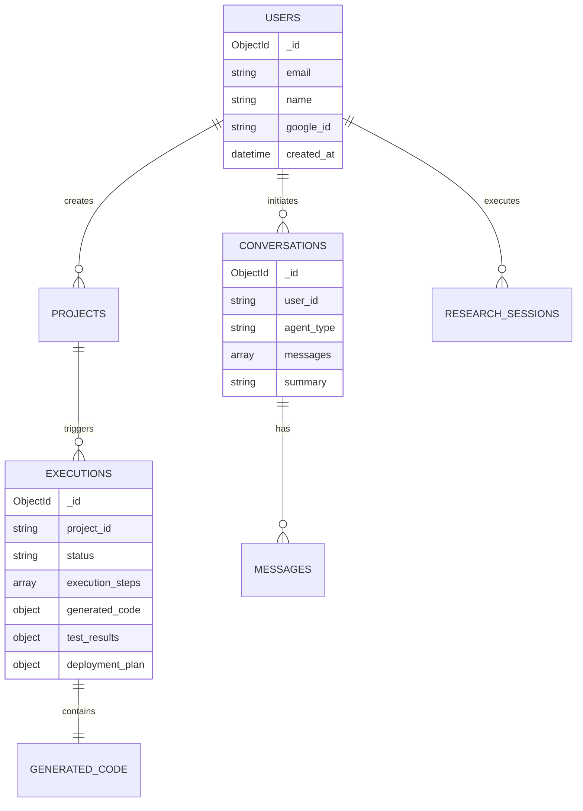
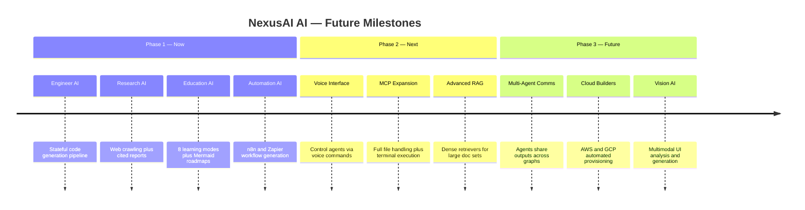

<div align="center">

<!-- Animated Header Banner -->


<!-- Live Typing Animation -->
<a href="https://git.io/typing-svg">
  
</a>

<br/>

<!-- Badge Row 1 -->
<p>
  
  
  
  
  
</p>

<!-- Badge Row 2 -->
<p>
  
  
  
  
  
</p>

<!-- Badge Row 3 -->
<p>
  
  
  
  
  
</p>

</div>

---

## ⚡ What is NexusAI?

> **NexusAI AI** is not just another AI chatbot — it's a full **Autonomous Multi-Agent Operating System** that treats LLMs as dynamic processing cores.
>
> Send it an idea. It **Plans → Codes → Tests → Debugs → Deploys** — completely on its own.

---

## 🌳 Engineer AI — Autonomous Pipeline (Tree View)

```
💡 Your Idea
│
└──► 🧠 PLANNER AGENT
     │   Reads your request → builds architectural blueprint
     │   Queries ChromaDB for relevant code templates
     │   Outputs: file list, dependencies, architecture spec
     │
     └──► 💻 CODER AGENT
          │   Iterates over every file in the plan
          │   Writes clean, modular, production-ready code
          │   Injects RAG context from ChromaDB memory
          │
          └──► 🧪 TESTER AGENT
               │   Runs AST parsing + lint checks on all files
               │   Verifies imports, syntax, and logic
               │   Outputs structured bug report per file
               │
               ├──► [❌ CRITICAL BUGS FOUND]
               │         │
               │         └──► 🔧 DEBUGGER AGENT
               │                   Traces each bug to source line
               │                   Applies targeted fix (no side effects)
               │                   Increments iteration counter
               │                   │
               │                   └──► 🔁 Back to TESTER AGENT
               │                        (loops until all tests pass
               │                         or max iterations reached)
               │
               └──► [✅ ALL TESTS PASS]
                         │
                         └──► 🚀 DEPLOYER AGENT
                                   Generates Dockerfile + Compose
                                   Builds Kubernetes pod specs
                                   Drafts cloud provider setup guide
                                   │
                                   └──► 💾 Saved to MongoDB
                                             │
                                             └──► 📡 SSE Stream
                                                       │
                                                       └──► 🖥️ Your Browser
```

---

## 🌳 All 5 Agent Module Trees

<details>
<summary><strong>🔍 Research AI — Full Pipeline Tree</strong></summary>

```
🔎 User Research Query
│
└──► 📋 RESEARCH PLANNER
     │   Parses intent → generates search outline
     │   Outputs: list of queries + crawl targets
     │
     └──► 🌐 SEARCH & SCRAPER TOOLS
          │   Hits search APIs (Google / Bing)
          │   Fetches & cleans article HTML → plain text
          │
          └──► 📝 SUMMARIZER AGENT
               │   Extracts key findings, metrics, arguments
               │   Stores summaries in temporary session memory
               │
               └──► ✍️ WRITER AGENT
                    │   Compiles sections into full report
                    │   Structures intro → body → conclusion
                    │
                    └──► 🔬 QUALITY REVIEWER
                         │   Checks factual consistency
                         │   Validates structure & completeness
                         │
                         └──► 📎 CITATION COMPILER
                                   Formats all source URLs as footnotes
                                   │
                                   └──► 📄 Markdown Report (saved to DB)
```

</details>

<details>
<summary><strong>🎓 Education AI — Intent Router Tree</strong></summary>

```
💬 User Prompt
│
└──► 🎯 INTENT DETECTOR
     │   Keyword classifier with priority rules
     │   Exam > Quiz > Coding > Interview > Roadmap > Revision > Notes > Learn
     │
     ├──► 📚 LEARN MODE         → Structured explanation + examples
     │
     ├──► 💻 CODING SANDBOX     → Live challenge + auto-grader
     │
     ├──► 🎤 INTERVIEW PREP     → Q&A simulator + feedback loop
     │
     ├──► ❓ QUIZ ENGINE         → MCQ / true-false / fill-in-the-blank
     │
     ├──► 🔁 FLASHCARD REVIEW   → Spaced repetition card deck
     │
     ├──► 🗺️ ROADMAP GENERATOR  → Mermaid timeline diagram output
     │
     ├──► 📝 SMART NOTES        → Structured markdown note compilation
     │
     └──► 📋 EXAM SIMULATOR     → Timed exam with scoring rubric
          │
          └──► ⚙️ RESPONSE FORMATTER
                    Embeds Mermaid diagrams + code highlighting
                    │
                    └──► 🖥️ React Client (rendered to user)
```

</details>

<details>
<summary><strong>⚡ Automation AI — Workflow Generator Tree</strong></summary>

```
🗣️ Plain English Automation Request
│
└──► 🧠 PLAN AGENT
     │   Extracts: triggers, integrations, variables, conditions
     │   Output:
     │   ├── trigger: { type, platform }
     │   ├── apps: [ "Slack", "Google Sheets", ... ]
     │   └── actions: [ { step, app, action }, ... ]
     │
     └──► ⚙️ WORKFLOW GENERATOR
          │   Builds platform-specific node config
          │   Sets webhook URLs, auth integrations, channel vars
          │
          └──► ✅ VALIDATOR AGENT
               │   Checks JSON schema compliance
               │   Detects broken links / circular loops
               │
               └──► 📐 FORMATTER AGENT
                         │
                         ├──► 📄 JSON Config    (n8n / Make / Zapier import)
                         │
                         ├──► 📊 Mermaid Diagram (visual workflow preview)
                         │
                         └──► 📖 Setup Guide    (Markdown step-by-step docs)
```

</details>

<details>
<summary><strong>🔐 Auth System — JWT + OTP Tree</strong></summary>

```
👤 User enters email
│
└──► POST /auth/otp/send
     │
     ├──► MongoDB: Fetch or create user profile
     │
     ├──► Generate 6-digit OTP
     │
     ├──► MongoDB: Store hashed OTP + expiration timestamp
     │
     └──► [Async Thread] Gmail SMTP → Send verification email
               │
               └──► 📬 User receives OTP in inbox
                         │
                         └──► POST /auth/otp/verify {email, code}
                                   │
                                   ├──► [✅ OTP Valid + Not Expired]
                                   │         │
                                   │         ├──► Sign JWT Token (RS256)
                                   │         └──► Return JWT + User Profile
                                   │
                                   └──► [❌ Invalid / Expired]
                                             └──► 401 Unauthorized
```

</details>

<details>
<summary><strong>💬 Conversational AI — RAG Memory Tree</strong></summary>

```
💬 User Chat Message
│
└──► RAG CONTEXT CHECK
     │
     ├──► [Project context exists?]
     │         │
     │         └──► 🧮 ChromaDB Vector Lookup
     │                   Semantic search on code index
     │                   Top-k relevant chunks retrieved
     │                   Injected into LLM system prompt
     │
     └──► ⚡ GROQ LLM INFERENCE
               │   Llama-3.3-70B processes full context
               │   Cyclic key rotation on rate limit
               │
               └──► 📊 MongoDB: Append message to conversation
                         │
                         └──► 📡 SSE Token Stream → 🖥️ Browser
                                   (real-time token-by-token output)
```

</details>

---

## 🏗️ System Architecture

```
╔═══════════════════════════════════════════════════════════════════╗
║                   NEXUSAI AI — SYSTEM MAP                     ║
╠═══════════════════════════════════════════════════════════════════╣
║                                                                   ║
║  🌐 REACT FRONTEND (Vite SPA)                                    ║
║  ┌──────────┬──────────┬──────────┬──────────┬────────────┐     ║
║  │Dashboard │Engineer  │ Research │Education │ Automation │     ║
║  │  Panel   │   UI     │  Viewer  │  Quizzes │  Canvas    │     ║
║  └────┬─────┴────┬─────┴─────┬────┴────┬─────┴──────┬─────┘     ║
║       └──────────┴───────────┼─────────┴────────────┘            ║
║                              │ Axios + SSE Streams                ║
║  ⚡ FASTAPI BACKEND (ASGI)   │                                    ║
║  ┌───────────────────────────▼──────────────────────────────┐    ║
║  │  JWT Auth  │  API Routes  │  OTP/SMTP  │  Admin Panel    │    ║
║  └───────────────────────────┬──────────────────────────────┘    ║
║                              │                                    ║
║  🤖 LANGGRAPH AGENT ENGINE   │                                    ║
║  ┌───────────────────────────▼──────────────────────────────┐    ║
║  │  Planner ──► Coder ──► Tester ──► Debugger ──► Deployer  │    ║
║  │              │                       │                    │    ║
║  │              └───────────────────────┘ (Cyclic Loop)      │    ║
║  └───────────────────────────┬──────────────────────────────┘    ║
║                              │                                    ║
║       ┌──────────────────────┼──────────────────────┐            ║
║       ▼                      ▼                      ▼            ║
║  📊 MongoDB           🧮 ChromaDB            🔄 Groq API         ║
║  (Persistent Store)  (Vector Memory)     (Cyclic Key Rotation)   ║
╚═══════════════════════════════════════════════════════════════════╝
```

---

## 🛠️ Full Tech Stack

| Layer | Technology | Version | Role |
|:------|:-----------|:--------|:-----|
| 🎨 **Frontend** | React + Vite | `^18.2.0` | Fast SPA with SSE streaming |
| 🎭 **Styling** | Vanilla CSS3 Variables | Native | Glassmorphic dark UI |
| ⚡ **Web Server** | FastAPI (ASGI) | `^0.100.0` | Async routes + SSE streaming |
| 🗄️ **Primary DB** | MongoDB + PyMongo | `^4.4.0` | Persistent document store |
| 🤖 **Agent Orchestration** | LangGraph | `^0.0.10` | Cyclic/acyclic state graphs |
| 🔗 **LLM Framework** | LangChain | `^0.0.250` | Prompts, chains & parsers |
| 🧮 **Vector DB** | ChromaDB | `^0.4.0` | Semantic code memory |
| ⚡ **Inference API** | Groq SDK | `^0.5.0` | Ultra-fast LLM inference |
| 🧠 **Primary LLM** | Llama-3.3-70B | Latest | Planning, coding, debugging |
| 👁️ **Vision Model** | Llama-3.2-11B-Vision | Latest | Image & UI analysis |
| 🔐 **Auth** | PyJWT + Passlib (bcrypt) | `^2.8.0` | JWT signing + OTP hashing |
| 📦 **Containers** | Docker + Compose | Latest | Portable deployment |
| ☁️ **Frontend Host** | Vercel | Latest | Edge-deployed React app |

---

## 📂 Project Structure

```
nexusai-ai/
│
├── 🐍 backend/
│   ├── 🤖 agents/
│   │   ├── engineer/          # Planner → Coder → Tester → Debugger → Deployer
│   │   ├── research/          # Planner → Scraper → Summarizer → Writer → Reviewer
│   │   ├── education/         # Intent detector + 8 learning mode engines
│   │   └── automation/        # Plan → Generate → Validate → Format
│   │
│   ├── 🌐 api/
│   │   ├── models/            # MongoDB document models
│   │   └── routes/            # REST endpoints (execution, research, education...)
│   │
│   ├── 🔐 auth/               # OTP creation, hashing & SMTP delivery
│   ├── 🧮 rag/                # ChromaDB collections, chunking & embeddings
│   ├── 🔄 llm/                # Groq client + cyclic key rotation
│   ├── 🗄️ db/                 # MongoDB client manager
│   └── 🚀 main.py             # FastAPI app entry point
│
├── ⚛️ frontend/
│   └── src/
│       ├── 🎨 components/     # Engineer, Research, Education, Automation UI
│       ├── 📄 pages/          # Dashboard, Login, Projects, Settings, Admin
│       ├── 🔌 services/       # Axios API clients
│       └── 🌐 contexts/       # Auth + Workspace global state
│
├── 🐳 docker-compose.yml
├── 📋 Dockerfile
└── 📖 README.md
```

---

## 🚀 Quick Start

### Prerequisites

```
Python 3.10+    Node.js 18+    MongoDB    Groq API Keys
```

### 1️⃣ Clone the Repository

```bash
git clone https://github.com/Himanshuyadav37/nexusai-ai.git
cd nexusai-ai
```

### 2️⃣ Backend Setup

```bash
cd backend

# Create & activate virtual environment
python -m venv venv
venv\Scripts\activate          # Windows
source venv/bin/activate        # macOS / Linux

# Install dependencies
pip install -r requirements.txt
cp .env.example .env
```

Configure your `.env`:

```env
# Groq API Keys (multiple = cyclic rotation = zero rate limits)
GROQ_KEY_1=gsk_xxxxxxxxxxxxxxxxxxxx
GROQ_KEY_2=gsk_xxxxxxxxxxxxxxxxxxxx
GROQ_MODEL=llama-3.3-70b-versatile

# Database
MONGO_URL=mongodb://localhost:27017
DB_NAME=nexusai

# Auth
JWT_SECRET=your_super_secret_signing_key_here

# OTP Email
GMAIL_USER=your_email@gmail.com
GMAIL_APP_PASSWORD=your_gmail_app_password
```

### 3️⃣ Frontend Setup

```bash
cd frontend
npm install
cp .env.example .env
```

```env
VITE_API_URL=http://localhost:8000
VITE_GOOGLE_CLIENT_ID=your_oauth_client_id.apps.googleusercontent.com
```

### 4️⃣ Launch 🚀

```bash
# Terminal 1 — Backend
cd backend
uvicorn main:app --reload --port 8000

# Terminal 2 — Frontend
cd frontend
npm run dev
```

> Open **http://localhost:5173** 🎉

### 🐳 Or use Docker

```bash
docker-compose up --build
```

---

## 📡 API Reference

<details>
<summary><strong>🔐 Auth — /auth</strong></summary>

#### Request OTP

```http
POST /auth/otp/send
Content-Type: application/json

{ "email": "user@example.com" }
```

Response:

```json
{ "success": true, "message": "Verification code sent to email" }
```

#### Verify OTP

```http
POST /auth/otp/verify
Content-Type: application/json

{ "email": "user@example.com", "code": "123456" }
```

Response:

```json
{
  "token": "eyJhbGciOiJIUzI1NiIsInR5cCI6IkpXVCJ9...",
  "user": { "id": "usr_1122", "email": "user@example.com" }
}
```

</details>

<details>
<summary><strong>💻 Engineer AI — /ai</strong></summary>

#### Trigger Code Generation

```http
POST /ai/generate
Authorization: Bearer <JWT_TOKEN>
Content-Type: application/json

{ "idea": "Build a FastAPI WebSocket chat server", "project_id": "proj_8877" }
```

Response:

```json
{
  "execution_id": "exec_5544",
  "status": "running",
  "message": "LangGraph multi-agent pipeline started"
}
```

#### Check Execution Status

```http
GET /ai/status/{execution_id}
Authorization: Bearer <JWT_TOKEN>
```

Response:

```json
{
  "status": "completed",
  "execution_steps": [
    { "agent": "planner", "status": "completed" },
    { "agent": "coder", "status": "completed" },
    { "agent": "tester", "status": "completed" },
    { "agent": "deployer", "status": "completed" }
  ],
  "generated_code": { "main.py": "from fastapi import FastAPI..." }
}
```

</details>

<details>
<summary><strong>⚡ Automation — /automation</strong></summary>

#### Generate Workflow

```http
POST /automation/plan
Authorization: Bearer <JWT_TOKEN>
Content-Type: application/json

{ "prompt": "Sync Stripe payments to Discord webhook", "platform": "n8n" }
```

Response:

```json
{
  "workflow_json": { "nodes": [], "connections": {} },
  "mermaid_diagram": "graph TD...",
  "setup_markdown": "# Setup steps..."
}
```

</details>

<details>
<summary><strong>🔍 Research — /research</strong></summary>

#### Start Research Session

```http
POST /research/start
Authorization: Bearer <JWT_TOKEN>
Content-Type: application/json

{ "query": "Latest advances in multimodal AI models 2025" }
```

Response:

```json
{
  "session_id": "res_7712",
  "status": "processing",
  "message": "Research pipeline initiated — crawling 8 sources"
}
```

</details>

<details>
<summary><strong>🧮 RAG — /rag</strong></summary>

#### Query Vector Memory

```http
POST /rag/query
Authorization: Bearer <JWT_TOKEN>
Content-Type: application/json

{ "query": "FastAPI WebSocket connection manager implementation" }
```

Response:

```json
{
  "results": [
    { "content": "...", "source": "project_docs", "score": 0.94 }
  ]
}
```

</details>

---

## 💾 Database Schema



---

## 🔑 Key Innovations

| Feature | How It Works |
|:--------|:------------|
| 🔄 **Cyclic Groq Key Rotation** | Switches API keys automatically on rate limits — zero downtime |
| 🧮 **Contextual RAG Retrieval** | ChromaDB semantic search injects code context into every agent prompt |
| ♻️ **Stateful Cyclic Graphs** | LangGraph Coder ↔ Tester ↔ Debugger loops until all tests pass |
| 📡 **SSE Token Streaming** | Frontend receives agent output token-by-token via Server-Sent Events |
| 🤖 **8-Mode Intent Classifier** | Education AI routes every message using keyword priority trees |
| 🔐 **Passwordless Auth** | Google OAuth 2.0 + OTP email — no passwords ever stored |
| 🧠 **Persistent Memory** | All conversations summarized + stored in MongoDB for cross-session context |
| 🐙 **GitHub Integration** | Push generated projects directly to GitHub from the UI |
| 🔌 **MCP Protocol** | Model Context Protocol for file-handling and terminal execution tools |

---

## 🗺️ Roadmap



---

## 🛡️ Security

| Policy | Implementation |
|:-------|:--------------|
| 🔑 **API Key Rotation** | Auto-switches Groq keys on rate limit exceptions |
| 🏖️ **Code Sandboxing** | Generated files isolated in `/generated_projects` |
| 🧹 **Input Sanitization** | All agent I/O sanitized against injection attacks |
| 🔏 **Signed JWTs** | RS256-signed tokens secure every protected route |
| 🔒 **Bcrypt Hashing** | OTP codes hashed with passlib before DB storage |

---

## 🤝 Contributing

```bash
# 1. Fork the repo on GitHub
# 2. Create your feature branch
git checkout -b feature/amazing-new-agent

# 3. Commit your changes
git commit -m "feat: add amazing new agent capability"

# 4. Push and open a Pull Request
git push origin feature/amazing-new-agent
```

---

<div align="center">


**Built with 🧠 by the NexusAI Core Team**

*LangGraph · LangChain · FastAPI · React · ChromaDB · Groq · MongoDB*

<br/>

<a href="https://github.com/Himanshuyadav37/NexusAI">
  
</a>

</div>
